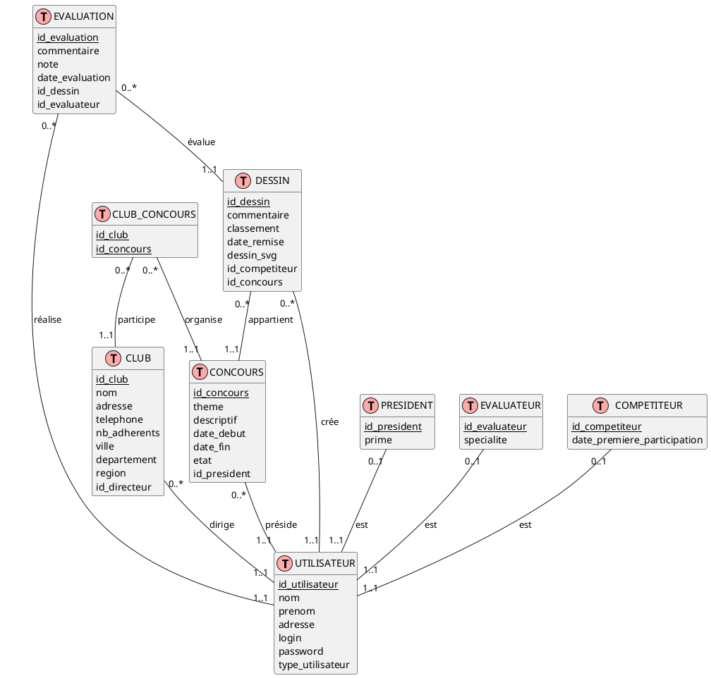

```plantuml


@startuml
!define table(x) class x << (T,#FFAAAA) >>
!define primary_key(x) <u>x</u>
hide methods
hide stereotypes

table(UTILISATEUR) {
    primary_key(id_utilisateur)
    nom
    prenom
    adresse
    login
    password
    type_utilisateur
}

table(CLUB) {
    primary_key(id_club)
    nom
    adresse
    telephone
    nb_adherents
    ville
    departement
    region
    id_directeur
}

table(CONCOURS) {
    primary_key(id_concours)
    theme
    descriptif
    date_debut
    date_fin
    etat
    id_president
}

table(DESSIN) {
    primary_key(id_dessin)
    commentaire
    classement
    date_remise
    dessin_svg
    id_competiteur
    id_concours
}

table(EVALUATION) {
    primary_key(id_evaluation)
    commentaire
    note
    date_evaluation
    id_dessin
    id_evaluateur
}

table(CLUB_CONCOURS) {
    primary_key(id_club)
    primary_key(id_concours)
}

table(PRESIDENT) {
    primary_key(id_president)
    prime
}

table(EVALUATEUR) {
    primary_key(id_evaluateur)
    specialite
}

table(COMPETITEUR) {
    primary_key(id_competiteur)
    date_premiere_participation
}

CLUB "0..*" -- "1..1" UTILISATEUR : dirige
CONCOURS "0..*" -- "1..1" UTILISATEUR : préside
DESSIN "0..*" -- "1..1" UTILISATEUR : crée
DESSIN "0..*" -- "1..1" CONCOURS : appartient
EVALUATION "0..*" -- "1..1" DESSIN : évalue
EVALUATION "0..*" -- "1..1" UTILISATEUR : réalise
CLUB_CONCOURS "0..*" -- "1..1" CLUB : participe
CLUB_CONCOURS "0..*" -- "1..1" CONCOURS : organise
PRESIDENT "0..1" -- "1..1" UTILISATEUR : est
EVALUATEUR "0..1" -- "1..1" UTILISATEUR : est
COMPETITEUR "0..1" -- "1..1" UTILISATEUR : est

@enduml


```