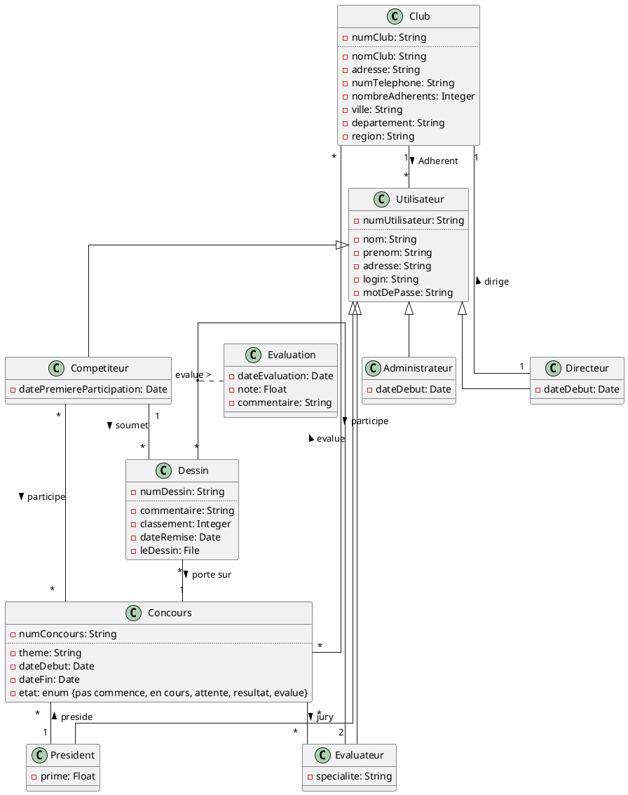

```plantuml
 @startuml scheme
skinparam linetype ortho

class Club {
  -numClub: String
  ..
  -nomClub: String
  -adresse: String
  -numTelephone: String
  -nombreAdherents: Integer
  -ville: String
  -departement: String
  -region: String
}

class Utilisateur {
  -numUtilisateur: String
  ..
  -nom: String
  -prenom: String
  -adresse: String
  -login: String
  -motDePasse: String
}

class Concours {
  -numConcours: String
  ..
  -theme: String
  -dateDebut: Date
  -dateFin: Date
  -etat: enum {pas commence, en cours, attente, resultat, evalue}
}

class Dessin {
  -numDessin: String
  ..
  -commentaire: String
  -classement: Integer
  -dateRemise: Date
  -leDessin: File
}

class Evaluation {
  -dateEvaluation: Date
  -note: Float
  -commentaire: String
}

class Competiteur {
  -datePremiereParticipation: Date
}

class President {
  -prime: Float
}

class Administrateur {
  -dateDebut: Date
}

class Directeur {
  -dateDebut: Date
}

class Evaluateur {
  -specialite: String
}

Utilisateur <|-- Competiteur
Utilisateur <|-- President
Utilisateur <|-- Administrateur
Utilisateur <|-- Directeur
Utilisateur <|-- Evaluateur

Club "1" -- "*" Utilisateur : Adherent >
Club "1" -- "1" Directeur : dirige <
Club "*" -- "*" Concours : participe >

Concours "*" -- "*" Evaluateur : jury >
Concours "*" -- "1" President : preside <


Competiteur "*" -- "*" Concours : participe >
Competiteur "1" -- "*" Dessin : soumet >


Dessin "*" -- "1" Concours : porte sur >


Evaluateur "2" -- "*" Dessin : evalue >
(Evaluateur, Dessin) . Evaluation : evalue >


@enduml
 

```
